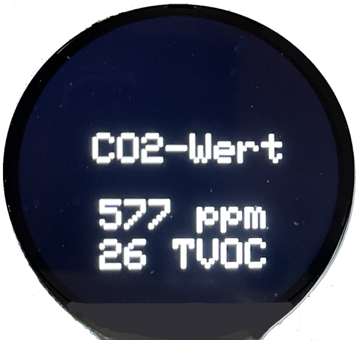

# CO2-Anzeige
CCS811 Sensor und GC9A01 Display

|[:skull:ISSUE](https://github.com/frankyhub/CO2-Anzeige/issues?q=is%3Aissue)|[:speech_balloon: Forum /Discussion](https://github.com/frankyhub/CO2-Anzeige/discussions)|[:grey_question:WiKi](https://github.com/frankyhub/CO2-Anzeige/wiki)||
|--|--|--|--|
| | | | |
||<a href="https://github.com/frankyhub/CO2-Anzeige/issues">|<a href="https://github.com/frankyhub/CO2-Anzeige/discussions">|<a href="https://github.com/frankyhub/CO2-Anzeige/releases">|
|| <a href="https://github.com/frankyhub/CO2-Anzeige/pulse" alt="Activity">| <a href="https://github.com/frankyhub/CO2-Anzeige/graphs/traffic">  |<a href="https://github.com/frankyhub?tab=stars"> |

## Story
Das Repo bescheibt ein Projekt das den CO2-Wert der Luft und flüchtige organische Verbindungen (TVOCs) in der Umwelt misst und anzeigt. Als Anzeige verwende ich das runde 1,28-Zoll-Display GC9A01 und als Controller dient ein Ardoino UNO.

  

## Verdrahtung

|UNO|Display|Sensor|
|--|--|--|
|3,3V|VCC|VCC|
|GND|GND|GND|
|13|SCL|-|
|11|SDA|-|
|7|DC|-|
|10|CS|-|
|8|RST|-|
|SCL|-|SCL|
|SDA|-|SDA|
|--|--|--|

---

   
<ol class="breadcrumb" style="border-top: 2px solid black;border-bottom:2px solid black; height: 45px; width: 900px;"> 
<a href="#oben">nach oben</a>
</ol>

